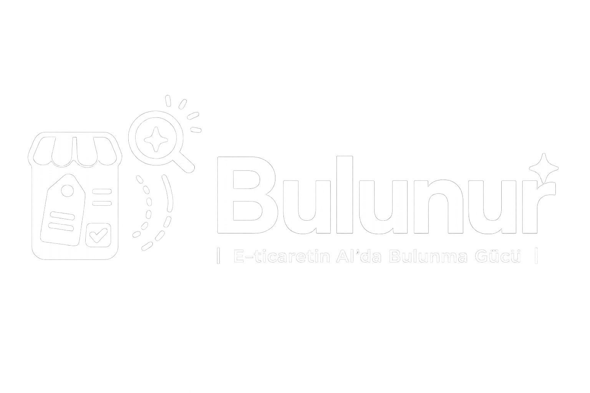
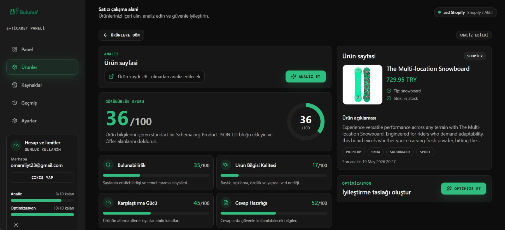
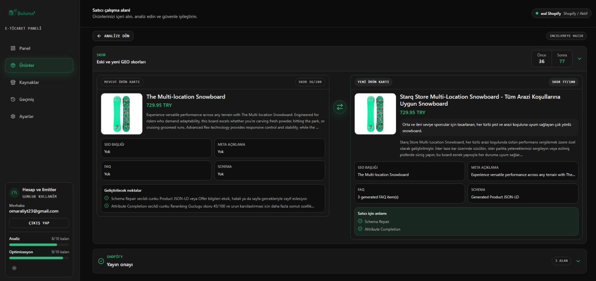

<div align="center">
  

  <h1>Bulunur: Türk E-Ticaret İçin GEO Optimizasyon Platformu</h1>

  <p>
    Bulunur, ürün sayfalarını yapay zeka arama motorları ve LLM cevapları için analiz eden,
    puanlayan ve güvenli şekilde iyileştiren bir GEO platformudur.
  </p>
  <p>
    Sistem; Gemini destekli semantik değerlendirme, LangGraph tabanlı ajan akışları,
    Schema.org Product JSON-LD iyileştirmeleri ve Türkçe alıcı niyeti odaklı içerik üretimini birleştirir.
  </p>

  <p>
    
    
    
    
    
    
    
    
    
    
  </p>

  <p>
    <a href="#demo"><strong>Demo</strong></a> ·
    <a href="#hızlı-başlangıç"><strong>Hızlı Başlangıç</strong></a> ·
    <a href="#sistem-mimarisi"><strong>Mimari</strong></a> ·
    <a href="#api"><strong>API</strong></a> ·
    <a href="#ekip"><strong>Ekip</strong></a>
  </p>
</div>

## Bulunur nedir?

Bulunur, Türk e-ticaret işletmelerinin ürünlerini yalnızca klasik SEO için değil, yapay zeka destekli arama ve cevap motorları için de daha anlaşılır hale getirmesine yardımcı olur.

Platform; bir ürün sayfasını analiz ederek ürünün ne kadar erişilebilir, makine tarafından anlaşılabilir, karşılaştırılabilir ve AI cevaplarına hazır olduğunu ölçer. Ardından eksik schema alanları, zayıf ürün açıklamaları, yetersiz özellikler, FAQ eksikleri ve Türkçe alıcı niyeti uyumsuzlukları gibi problemleri belirler.

İyileştirme aşamasında Bulunur, ürün gerçeklerini uydurmadan çalışır. Sadece mevcut ürün verisi, crawler çıktısı ve kullanıcı tarafından doğrulanan bilgilerle güvenli öneriler üretir. Böylece satıcılar ürünlerini Schema.org Product JSON-LD, Türkçe alıcı soruları, karşılaştırma sinyalleri ve AI cevaplanabilirliği açısından daha güçlü hale getirebilir.

<p align="center">
  
</p>

<p align="center">
  
</p>

## Neden Bulunur?

Kullanıcıların ürün keşfetme alışkanlığı değişiyor. İnsanlar artık yalnızca klasik arama motorlarında sonuç listesi gezmiyor; ChatGPT, Gemini, Perplexity ve Google AI Overviews gibi yapay zeka destekli cevap sistemlerine doğrudan soru soruyor.

Bu değişim e-ticaret için kritik bir anlam taşıyor: Bir ürünün görünür olması artık sadece SEO sıralamasına bağlı değil. LLM'lerin ürünü anlayabilmesi, güvenilir kaynaklardan doğrulayabilmesi, karşılaştırabilmesi ve kullanıcıya net bir cevap içinde önerebilmesi gerekiyor.

Gartner, geleneksel arama motoru hacminin 2026'ya kadar yapay zeka chatbotları ve sanal ajanlar nedeniyle %25 düşebileceğini öngörüyor. Google tarafında ise AI Overviews özelliğinin aylık milyarlarca kullanıcıya ulaştığı açıklandı. Bu sinyaller, arama davranışının klasik link listesinden AI cevaplarına doğru kaydığını gösteriyor.

SEO döneminde web siteleri arama motorlarına daha anlaşılır olmak için başlık, meta açıklama, içerik, link yapısı ve teknik optimizasyonlara yatırım yaptı. Yeni dönemde aynı ihtiyaç GEO için ortaya çıkıyor:

- Ürün verisi LLM'ler tarafından kolay anlaşılmalı.
- Schema.org Product verisi eksiksiz ve tutarlı olmalı.
- Ürün açıklamaları Türkçe alıcı niyetlerini karşılamalı.
- FAQ, özellikler, güven sinyalleri ve karşılaştırma bilgileri doğrulanabilir olmalı.
- AI sistemleri ürünü yanlış anlamadan, uydurma bilgi üretmeden cevap verebilmeli.

Bulunur'un algoritması özellikle Türkçe e-ticaret için optimize edilmiştir. Sistem; Türkçe ürün açıklamalarını, yerel alıcı soru kalıplarını, "alınır mı", "öneri", "karşılaştırma", "kargo", "iade" gibi satın alma niyetlerini ve Türkiye pazarındaki ürün sayfası alışkanlıklarını dikkate alır.

Bulunur bu yüzden geliştirildi: Türk e-ticaret işletmelerinin ürünlerini AI çağında daha bulunabilir, anlaşılabilir ve cevaplanabilir hale getirmek.

## Özellikler

Bulunur'un GEO algoritması mock bir puanlama sistemi değildir. Algoritma; Google Product structured data ve merchant listing dokümantasyonu, Schema.org Product modeli ve GEO alanındaki araştırma fikirleri üzerine tasarlanmıştır.

[SAGEO Arena](docs/research_papers/SAGEO%20Arena.pdf) yaklaşımından aldığımız ana fikir, GEO'yu tek bir "içerik kalitesi" skoru gibi değil, AI cevap sistemlerinin çalışma hattına benzer katmanlar halinde değerlendirmektir. Bu yüzden Bulunur ürünü dört aşamada inceler: ürünün AI/crawler tarafından alınabilir olması, makine tarafından yapısal olarak anlaşılması, benzer ürünler arasında karşılaştırma ve reranking sinyallerine sahip olması, son olarak da AI cevabı içinde güvenli ve net şekilde kullanılabilmesi.

[AgenticGEO](docs/research_papers/AgenticGEO.pdf) yaklaşımından aldığımız fikir ise optimizasyonun sabit bir checklist olmaması gerektiğidir. Bulunur önce ürünün en zayıf GEO katmanlarını bulur, sonra optimizasyon ajanı bu zayıflıklara göre strateji seçer. Örneğin schema eksikse `Schema Repair`, ürün özellikleri zayıfsa `Attribute Completion`, AI cevapları için soru-cevap eksikse `Turkish FAQ Enrichment`, ürün metni semantik olarak zayıfsa `Turkish Buyer Intent Rewrite` devreye girer.

Skor üretimi iki parçadan oluşur: deterministik kontroller ve Gemini semantik yargısı. Deterministik taraf; URL/crawler erişilebilirliği, temel ürün alanları, JSON-LD schema yapısı, fiyat-stok bilgisi, attribute kapsamı ve FAQ varlığı gibi ölçülebilir sinyalleri değerlendirir. Gemini tarafı ise ürün içeriğinin Türkçe alıcı niyetlerini ne kadar karşıladığını, AI cevaplarında güvenli şekilde kullanılıp kullanılamayacağını ve ürünün karşılaştırma/öneri sorgularında ne kadar anlaşılır olduğunu değerlendirir.

Bu nedenle Bulunur, yalnızca "alan var mı?" kontrolü yapmaz. Ürünün AI sistemleri tarafından bulunabilir, anlaşılabilir, sıralanabilir ve cevap içinde güvenle önerilebilir olup olmadığını araştırma tabanlı dört katmanlı bir GEO skoru ile ölçer; ardından AgenticGEO mantığıyla iyileştirme stratejisini seçer.

- **GEO Analiz Skoru:** Ürünleri 100 puan üzerinden değerlendirir ve skoru dört ana katmana böler: retrieval, makine anlayışı, reranking gücü ve AI cevap hazırlığı.
- **Dört Katmanlı Değerlendirme:** Ürünün crawler tarafından erişilebilirliğini, Schema.org uyumluluğunu, karşılaştırma sinyallerini ve AI cevaplarında kullanılabilirliğini ayrı ayrı ölçer.
- **Gemini Destekli Semantik Yargı:** Sadece alanların varlığına bakmaz; ürün metninin Türkçe alıcı sorularını gerçekten cevaplayıp cevaplayamadığını semantik olarak değerlendirir.
- **Agentic GEO Optimizasyonu:** LangGraph tabanlı optimizasyon ajanı, ürünün zayıf katmanlarına göre uygun stratejileri seçer ve uygulanabilir iyileştirme çıktıları üretir.
- **Schema.org Product JSON-LD İyileştirmesi:** Ürün, marka, fiyat, stok, görsel ve attribute verilerini kullanarak AI ve arama motorları için daha anlaşılır structured data üretir.
- **Türkçe Alıcı Niyeti Odaklı İçerik:** Ürün başlığı, açıklama, FAQ ve önerileri Türkçe e-ticaret arama davranışlarına göre güçlendirmeyi hedefler.
- **Güvenli FAQ Üretimi:** Kullanıcıların sorabileceği ürün sorularını üretir, ancak cevapları yalnızca doğrulanmış ürün bilgilerine dayandırır.
- **Eksik Bilgi Toplama Akışı:** Kritik ürün bilgisi eksikse uydurmak yerine kullanıcıya hedefli sorular sorar.
- **Anti-Hallucination Kontrolü:** Garanti, sertifika, kargo, stok, organik içerik veya performans gibi doğrulanmamış iddiaları engellemeye çalışır.
- **Before/After Optimizasyon Çıktısı:** Kullanıcıya hangi alanların iyileştirildiğini ve tahmini yeni GEO skorunu gösterir.
- **FastAPI AI Servisi:** Web uygulamasının analiz ve optimizasyon akışlarını çağırabilmesi için ayrı bir AI servisi olarak çalışır.
- **Docker ve Railway Hazırlığı:** AI servisi Dockerfile ile containerize edilmiştir ve Railway üzerinde ayrı servis olarak deploy edilebilir.

## Sistem Nasıl Çalışır?

Bulunur, web dashboard'u ile AI/GEO servisini ayrı çalışan iki katman olarak tasarlar. Web tarafı ürünleri mağazadan veya URL tabanlı kaynaklardan alır, AI servisi ise bu ürünleri analiz edip iyileştirme çıktıları üretir.

### 1. Ürün Verisi Alınır

Satıcı ürünlerini Shopify bağlantısı veya native URL/import akışı üzerinden dashboard'a getirir. Web katmanı ürün başlığı, açıklama, fiyat, stok, görseller, attribute bilgileri, crawler metadata ve varsa mevcut structured data sinyallerini hazırlar.

### 2. GEO Analizi Çalışır

Kullanıcı analiz başlattığında web uygulaması ürünü AI servisine gönderir. GEO Analysis Agent ürünü dört katmanda puanlar:

- **Retrieval:** Ürün sayfası AI/crawler tarafından erişilebilir ve alınabilir mi?
- **Machine Understanding:** Ürün Schema.org Product ve temel alanlarla makine tarafından anlaşılabilir mi?
- **Reranking Strength:** Ürün benzer ürünler arasında karşılaştırılabilir somut sinyallere sahip mi?
- **AI Answer Readiness:** Ürün, AI cevabı içinde güvenli ve net şekilde açıklanabilir mi?

### 3. Zayıf Katmanlar Belirlenir

Analiz sonucu yalnızca toplam skor döndürmez. Her katman için nedenler, eksik sinyaller ve önerilen sonraki adım üretilir. Böylece sistem hangi problemin skoru düşürdüğünü açık şekilde bilir.

### 4. Optimizasyon Ajanı Strateji Seçer

Kullanıcı iyileştirme başlattığında GEO Optimization Agent analiz sonucunu okur ve zayıf katmanlara göre strateji seçer. Örneğin schema eksikse schema repair, ürün özellikleri eksikse attribute completion, içerik AI cevapları için zayıfsa Turkish buyer intent rewrite, FAQ eksikse Turkish FAQ enrichment çalışır.

### 5. Eksik Gerçekler Kullanıcıya Sorulur

Sistem kritik bir bilgiyi bilmiyorsa uydurmaz. Stok, marka, kullanım alanı, garanti, iade veya kargo gibi doğrulanması gereken bilgiler için kullanıcıdan hedefli cevap ister. Bu sayede üretilen iyileştirmeler gerçek ürün bilgilerine dayanır.

### 6. Güvenli İyileştirme Çıktısı Üretilir

Seçilen stratejilere göre ürün için JSON-LD schema, FAQ, önerilen attribute alanları, Türkçe içerik iyileştirmeleri ve AI cevaplanabilirliğini artıran çıktı üretilir. Validation katmanı doğrulanmamış iddiaları warning olarak işaretler.

### 7. Tahmini Yeni GEO Skoru Hesaplanır

İyileştirme çıktısı uygulandığında ürünün tahmini yeni GEO skoru hesaplanır. Sistem yalnızca toplam skoru değil, dört katmanın yeni skorlarını da döndürür. Web dashboard'u bu veriyi kullanıcıya before/after olarak gösterir.

### 8. Kullanıcı Onaylar ve Yayınlar

Satıcı üretilen iyileştirmeleri dashboard üzerinden inceler. Eğer kullanıcı Shopify mağazasıyla giriş yapmış ve mağazasını Bulunur'a bağlamışsa, onaylanan değişiklikler Shopify entegrasyonu üzerinden güvenli şekilde mağazaya geri gönderilebilir.

Daha detaylı ürün ve mimari açıklaması için [PRD dokümanını](docs/PRD.md) okuyabilirsiniz.

## Tech Stack

Bulunur monorepo yapısında iki ana parçadan oluşur: web uygulaması ve AI/GEO servisi.

### Web

- **Next.js:** Dashboard, ürün akışları ve backend route katmanı
- **TypeScript:** Tip güvenli frontend ve server-side kod
- **Supabase:** Veritabanı, kimlik doğrulama ve server-side workflow kayıtları
- **Shopify API:** Bağlı mağazalardan ürün çekme ve iyileştirilmiş çıktıları geri yayınlama

### AI / GEO Servisi

- **Python:** GEO scoring, schema engine ve agent workflow kodu
- **FastAPI:** Web uygulamasının çağırdığı AI servis endpoint'leri
- **LangChain:** Gemini çağrıları, prompt/skill kullanımı ve structured output akışı
- **LangGraph:** GEO Analysis Agent ve GEO Optimization Agent için stateful workflow orchestration
- **Google Gemini:** Semantik değerlendirme, Türkçe alıcı niyeti analizi ve güvenli içerik üretimi
- **Pydantic:** API contract modelleri ve veri doğrulama
- **Schema.org Product JSON-LD:** Ürünleri AI ve arama sistemleri için daha anlaşılır hale getiren structured data katmanı

### Deployment

- **Docker Compose:** Local full-stack çalışma ortamı
- **Docker:** AI ve web servislerini container olarak paketleme
- **Vercel:** Web uygulamasının production deployment ortamı
- **Railway:** AI/GEO servisinin production deployment ortamı

## Docker Compose ile Çalıştırma

Projeyi local ortamda tam sistem olarak çalıştırmak için Docker ve Docker Compose kurulu olmalıdır. Compose iki servisi birlikte ayağa kaldırır:

- `ai`: FastAPI tabanlı GEO analiz ve optimizasyon servisi
- `web`: Next.js tabanlı dashboard ve backend route katmanı


Önce AI servisi için gerekli ortam değişkenlerini hazırlayın. `ai/.env` dosyasında en az şu değerler bulunmalıdır:

```env
GOOGLE_API_KEY=your_gemini_api_key
SERVICE_AUTH_SECRET_KEY=your_internal_service_secret
```

Web servisi için `web/.env.local` dosyasında Supabase, Shopify ve AI servis değişkenleri bulunmalıdır:

```env
NEXT_PUBLIC_SUPABASE_URL=your-project-url
NEXT_PUBLIC_SUPABASE_PUBLISHABLE_KEY=your-publishable-or-anon-key
SUPABASE_SECRET_KEY=your-server-side-supabase-secret

AI_SERVICE_URL=http://ai:8001
AI_SERVICE_SECRET=your_internal_service_secret

SHOPIFY_CLIENT_ID=your-shopify-client-id
SHOPIFY_CLIENT_SECRET=your-shopify-client-secret
SHOPIFY_SCOPES=read_products,write_products
SHOPIFY_APP_URL=your-shopify-app-url
SHOPIFY_REDIRECT_URI=your-shopify-callback-url
SHOPIFY_API_VERSION=2026-04
SHOPIFY_TOKEN_ENCRYPTION_KEY=your-stable-token-encryption-key
```

`NEXT_PUBLIC_SUPABASE_URL` ve `NEXT_PUBLIC_SUPABASE_PUBLISHABLE_KEY` build sırasında da gerektiği için root `.env` dosyasına veya terminal environment değişkenlerine de eklenmelidir:

```env
NEXT_PUBLIC_SUPABASE_URL=your-project-url
NEXT_PUBLIC_SUPABASE_PUBLISHABLE_KEY=your-publishable-or-anon-key
```

Ardından repo kök dizininde tam sistemi çalıştırın:

```bash
docker compose up --build
```

Arka planda çalıştırmak için:

```bash
docker compose up --build -d
```

Servisler varsayılan olarak şu adreslerde çalışır:

```text
Web: http://localhost:3000
AI:  http://localhost:8001
```

AI servisini tek başına çalıştırmak isterseniz:

```bash
docker compose up --build ai
```

Health check endpoint'i:

```text
AI:  http://localhost:8001/health
Web: http://localhost:3000
```

Tüm sistemi durdurmak için:

```bash
docker compose down
```

## License

Licensed under the MIT License. See [LICENSE](LICENSE).

## Contributors

<table>
  <tr>
    <td align="center" width="50%">
      <br/><br/>
      <strong><a href="https://www.linkedin.com/in/muhammed-erbay-00811422a/">Muhammed Erbay</a></strong><br/>
      <sub>Contributor</sub><br/><br/>
      <a href="https://www.linkedin.com/in/muhammed-erbay-00811422a/">
        
      </a>
      <a href="https://github.com/muhammederbay10">
        
      </a>
    </td>
    <td align="center" width="50%">
      <br/><br/>
      <strong><a href="https://www.linkedin.com/in/%C3%B6mer-mevl%C3%BCto%C4%9Flu-ab7105257/">Ömer Mevlütoğlu</a></strong><br/>
      <sub>Contributor</sub><br/><br/>
      <a href="https://www.linkedin.com/in/%C3%B6mer-mevl%C3%BCto%C4%9Flu-ab7105257/">
        
      </a>
      <a href="https://github.com/Omer-Mevlutoglu">
        
      </a>
    </td>
  </tr>
</table>
